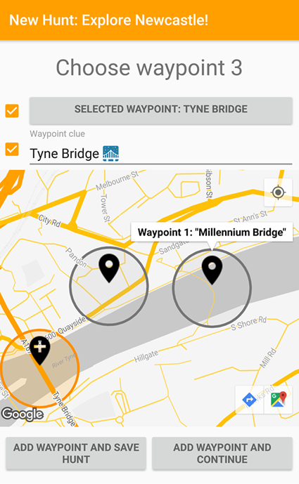
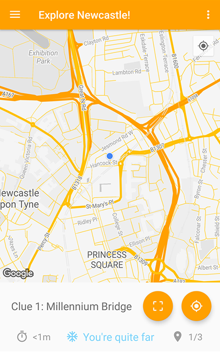
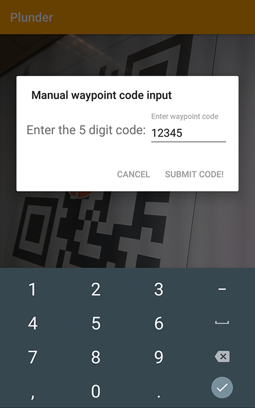
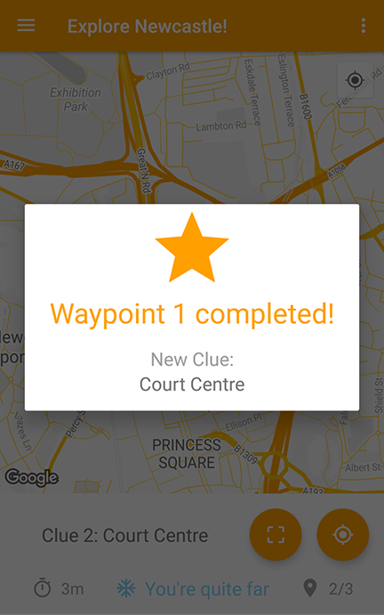

# Welcome to Plunder!
Explore the world with user created hunts!

Compete in Plunders against others for rewards and fun!

The backend for the app can be found here: [Plunder_Backend](https://github.com/yatharthasharma/Plunder_Backend)

### Causion
**App is not in a complete finished state**

**The developement on the project is currently on hold**

## How does it work?
1. Use your Plunder account to create custom treasure hunts around your city!
2. Leave clues at each waypoint leading the players to the next waypoint!
3. Allow others to follow your hunts, or use them to create a Plunder!
4. A Plunder is an organised even using one of your hunt with a given time and date allowing for social events such as grub or bar crawls!
The possibilities are endless and it is a great way to socialise, make new friends and explore!

What places do you want to show the world?
* Best coffee shops in the city?
* Best scenery viewpoints?
* Best clubs and bars?

Allow everyone to experience what's best!

</img>
</img>
</img>
</img>

## About
This was a Newcastle Univeristy year-long Andorid app developement team project.
We have set out to design an app to allow anyone to create treasure hunts for any other user of the app.
The original concept was designed with new university students in mind to allow them to follow user created treasure hunt in order to femiliarise themselves with the University campus and to find new areas in a new city.

### Credits
Code written by:
  - [Szymon Jackiewicz](https://github.com/SzyJ)   |   Programing Team Leader, Front-End Designer and developer
  - [Yathartha Sharma](https://github.com/yatharthasharma)    |   Research and back-end programmer
  - [Guillermo Chibas](https://github.com/guillech)    |   Overall Team Leader and back-end programmer
  - [Harry Jennings](https://github.com/HJWJennings)  |   Flex

Team Members:
  - Alana Horada    |   Lead of Documentation
  - Alex Megahy     |   Lead of Testing
  - Dalton Yates    |   Deputy Team Leader
  - Edward Jacobs   |   Promotional Website Designer
  - Haaris Qureshi  |   Lead of Design
